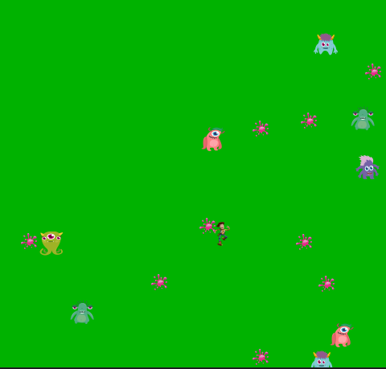
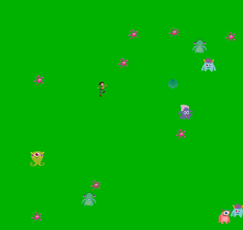

# 🤠 FreezeMonster - A Invasão Alienígena e o Raio de Gelo

**FreezeMonster** é um jogo de ação inspirado no universo do cowboy Wood, que precisa enfrentar uma invasão alienígena. Utilizando o padrão **Factory**, o jogo simula um cenário de defesa onde o cowboy luta contra alienígenas que disparam gosmas em direções aleatórias. O objetivo é sobreviver e derrotar os inimigos utilizando o poder do Raio de Gelo, uma habilidade especial que congela e elimina os alienígenas.

## 🚀 Como Jogar:

- **Movimentação do Cowboy:** Use as teclas de direção para mover o cowboy Wood pela tela.
- **Atirar Raio de Gelo:** Pressione a tecla **Espaço** para disparar o Raio de Gelo e congelar os alienígenas. Cada vez que um alienígena é atingido, ele é eliminado do jogo.
- **Invasão Alienígena:** Os alienígenas disparam gosmas em direções aleatórias e, caso atinjam o cowboy, ele perde a partida.

O objetivo do jogo é eliminar o máximo de alienígenas possível enquanto desvia das gosmas que são disparadas contra o cowboy.

## 🛠️ Funcionalidades:
- **Padrão Factory:** Utiliza o padrão de design **Factory** para a criação de objetos (alienígenas e outras entidades), permitindo uma estrutura modular e escalável.
- **Movimentação do Cowboy:** O jogador pode mover o cowboy pelas direções, evitando os ataques alienígenas.
- **Disparo do Raio de Gelo:** O cowboy pode atirar um Raio de Gelo que elimina os alienígenas ao acertá-los.
- **Alienígenas aleatórios:** Alienígenas se movem e atiram gosmas em direções aleatórias, tornando o jogo imprevisível e desafiador.
- **Aumento de dificuldade:** A cada rodada, o número de alienígenas e a velocidade das gosmas aumentam, desafiando ainda mais o jogador.

## 📚 Tecnologias Utilizadas:
- **Java:** O jogo foi desenvolvido em Java, utilizando conceitos de programação orientada a objetos e o padrão Factory.
- **Padrão Factory:** O padrão **Factory** foi usado para criar os diferentes tipos de alienígenas e outras entidades no jogo.
- **Java Swing:** A interface gráfica foi desenvolvida com Java Swing, proporcionando uma experiência visual fluida e divertida.
- **Eventos e Listeners:** Utiliza eventos de teclado para controlar a movimentação do cowboy e o disparo do Raio de Gelo.
